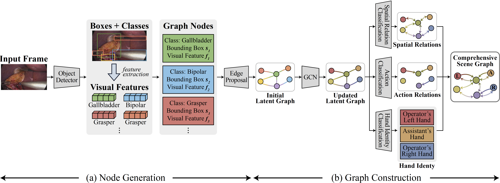

# **Towards Holistic Surgical Scene Graph**
This repository contains the official implementation of our MICCAI 2025 paper:
Towards Holistic Surgical Scene Graph 

[](https://ailab-kyunghee.github.io/SSG-Com/)

## 📂 Dataset: Endoscapes-SG201
We introduce Endoscapes-SG201, an extension of the Endoscapes dataset.
Endoscapes-SG201 provides:

•	✅ Refined instrument annotations (6 instrument sub-classes: Hook, Grasper, Clipper, Bipolar, Irrigator, Scissors).

•	✅ Triplet (Instrument–Verb–Target Anatomy) annotations.

•	✅ Hand identity labels (Operator's right, left, assistant).

**Downloads:**

Download the Endoscapes dataset from [](https://github.com/CAMMA-public/Endoscapes)

Download Endoscapes-SSG201 from [](https://1drv.ms/u/c/56d948a627b33139/EbqOPJgj0khEuDYYz0593g4B8vvysiOjLDq1LvbNeQqt8A?e=v16HXg)


The final directory structure should be as follows:
```shell
data/mmdet_datasets
└── endoscapes/
    └── train/
        └── 1_14050.jpg
        ...
        └── 120_40750.jpg
        └── annotation_coco.json
        └── annotation_ds_coco.json
        └── annotation_coco_vid.json
        └── train_endo_with_tri_annotations_coco.json
        └── train_endoscapes_ssg201_coco_with_ds.json
    └── val/
        └── 121_23575.jpg
        ...
        └── 161_39400.jpg
        └── annotation_coco.json
        └── annotation_ds_coco.json
        └── annotation_coco_vid.json
        └── val_endo_with_tri_annotations_coco.json
        └── val_endoscapes_ssg201_coco_with_ds.json
    └── test/
        └── 162_1225.jpg
        ...
        └── 201_55250.jpg
        └── annotation_coco.json
        └── annotation_ds_coco.json
        └── annotation_coco_vid.json
        └── test_endo_with_tri_annotations_coco.json
        └── test_endoscapes_ssg201_coco_with_ds.json
```

## Installation
⚠️ Note: For installation and environment setup, follow the original Endoscapes implementation provided in [](https://github.com/CAMMA-public/SurgLatentGraph/tree/main).  
Our dataset (Endoscapes-SSG201) builds on top of this setup.

```sh
# clone mmdetection and export environment variable
> cd $HOME && git clone https://github.com/open-mmlab/mmdetection.git
> export MMDETECTION=$HOME/mmdetection

# clone SSG-Com
> cd $HOME && git clone https://github.com/ailab-kyunghee/SSG-Com.git
> cd SSG-Com

# download pretrained weights
> cd weights
> wget -O coco_init_wts.zip https://seafile.unistra.fr/f/71eedc8ce9b44708ab01/?dl=1 && unzip coco_init_wts.zip && cd ..

# add SSG-Com to PYTHONPATH to enable registry to find custom modules 
> export PYTHONPATH="$PYTHONPATH:$HOME/SSG-Com"

Update the dataset path by replacing: data_root='/local_datasets/endoscapes' to '/path/to/your/endoscapes'

```

## Train & Test
**SSG-COM**
<div align="center">

</div>

```sh
mkdir -p work_dirs_ssg_com

mim train mmdet configs/models/faster_rcnn/lg_faster_rcnn_ssg201.py --work-dir work_dirs_ssg_com/ssg_com

Downstream Task CVS
mim train mmdet configs/models/faster_rcnn/lg_ds_faster_rcnn_ssg201_cvs.py --cfg-options load_from={Best Epoch Path} --work-dir work_dirs_ssg_com/ssg_com_CVS

Downstream Task Surgical Action Triplet
mim train mmdet configs/models/faster_rcnn/lg_ds_faster_rcnn_pplus_triplet_full.py --cfg-options load_from={Best Epoch Path} --work-dir work_dirs_ssg_com/ssg_com_TRIPLET  

```
