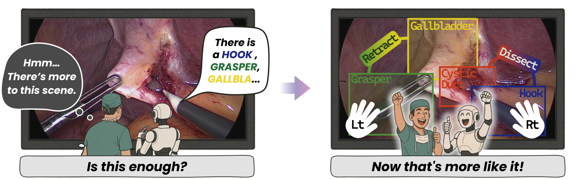

<!-- Hero Illustration + 링크 버튼 -->
<section class="section pt-4 pb-3">
  

    

      

        <figure class="figure section-figure">
          
        </figure>
      

    

    

      

        

          
          <a href="{{ page.paper_url }}" target="_blank" rel="noopener" class="button is-dark is-rounded is-small">
            <i class="fas fa-file-pdf"></i>Paper
          </a>
          
          
          <a href="{{ page.eposter_url }}" target="_blank" rel="noopener" class="button is-dark is-rounded is-small">
            <i class="fas fa-file-pdf"></i>Poster
          </a>
          
          
          <a href="{{ page.code_url }}" target="_blank" rel="noopener" class="button is-link is-rounded is-small">
            <i class="fab fa-github"></i>Code
          </a>
          
        

      

    

  

</section>

<!-- Abstract -->
<section class="section pt-4 pb-4">
  

    

      

        <h3 class="h-subtitle">Abstract</h3>
        

          Surgical scene understanding is crucial for computer-assisted intervention systems, requiring visual comprehension of surgical scenes that involves diverse elements such as surgical tools, anatomical structures, and their interactions.
          To effectively represent the complex information in surgical scenes, graph-based approaches have been explored to structurally model surgical entities and their relationships.
          However, aspects such as tool–action–target combinations and the identity of the operating hand remain underexplored.
          To address this, we propose <b>Endoscapes-SG201</b>, a new dataset including annotations for action triplets (tool–action–target) and hand identity.
          We also introduce <b>SSG-Com</b>, a graph-based method designed to represent these critical elements.
          Experiments on downstream tasks—Critical View of Safety (CVS) assessment and action triplet recognition—demonstrate the importance of integrating these scene graph components, significantly advancing holistic surgical scene understanding.
        

      

    

  

</section>

<!-- 이하 내용은 그대로 유지 -->

<!-- Main Contributions -->
<section class="section pt-5 pb-5">
  

    

      

        <h1 class="h-title">Main Contributions</h1>
      

    

    

      

        <figure class="figure section-figure">
          
        </figure>

        <h3 class="h-minor mt-5">Endoscapes-SG201</h3>
        <figure class="figure section-figure">
          
        </figure>

        

          

            We were fortunate to build <a href="https://github.com/ailab-kyunghee/SSG-Com" target="_blank" rel="noopener">Endoscapes-SG201</a>, a dataset for holistic scene graph research, by extending and refining the publicly available <a href="https://github.com/CAMMA-public/Endoscapes" target="_blank" rel="noopener">Endoscapes-Bbox201</a> dataset released by CAMMA.
            To annotate additional labels, two clinical experts from Samsung Medical Center refined the bounding boxes in Endoscapes-Bbox201.
          

          <ul>
            <li><b>Step 1</b>: We refined Bounding Boxes from Endoscapes-Bbox201</li>
            <li><b>Step 2</b>: We subdivided the 'Tool' class into 6 classes</li>
            <li><b>Step 3</b>: We annotated Action labels (tool–structure interactions) and Hand Identity labels (which hand manipulates each tool)</li>
          </ul>
        

      

    

  

</section>

<!-- Dataset Comparison -->
<section class="section pt-4 pb-5">
  

    

      

        <h3 class="h-subtitle">Dataset Comparison</h3>
      

    

    

      

        <figure class="figure section-figure">
          
        </figure>
        

          
This table contrasts the datasets used in previous surgical scene graph studies with Endoscapes-SG201.

          <ul>
            <li>Endoscapes-SG201 is designed with holistic scene graph research in mind.</li>
            <li>It incorporates:
              <ul>
                <li>Diverse tools and anatomical structures as graph nodes.</li>
                <li>Diverse relationships as graph edges.</li>
                <li>Hand Identity labels as attributes of the tool nodes.</li>
              </ul>
            </li>
            <li>By unifying these elements, the dataset provides a more expressive and comprehensive foundation for modeling surgical scenes.</li>
          </ul>
        

      

    

  

</section>

<!-- Endoscapes-SG201 Details -->
<section class="section pt-4 pb-5">
  

    

      

        <h3 class="h-subtitle">Endoscapes-SG201 Details</h3>
      

    

    

      

        <figure class="figure section-figure">
          
        </figure>
        

          
This table presents the category-wise distribution of the additional labels introduced in Endoscapes-SG201.

          
<b>Additional Annotations:</b>

          <ul>
            <li><b>6 Surgical Instruments</b>: Hook (HK), Grasper (GP), Clipper (CL), Bipolar (BP), Irrigator (IG), Scissors (SC)</li>
            <li><b>6 Surgical Actions</b>: Dissect (Dis.), Retract (Ret.), Grasp (Gr.), Clip (Cl.), Coagulate (Co.), Null</li>
            <li><b>3 Hand Identities</b>: Operator’s Right Hand (Rt), Operator’s Left Hand (Lt), Assistant’s Hand (Assi)</li>
          </ul>
        

      

    

  

</section>

<!-- SSG-Com -->
<section class="section pt-5 pb-5">
  

    

      

        <h2 class="h-title">SSG-Com</h2>
      

    

    

      

        <figure class="figure section-figure">
          
        </figure>
      

    

    

      

        

          
<b>SSG-Com</b> is designed to leverage the diverse labels of Endoscapes-SG201.

          <ol>
            <li>
              <b>Graph Construction</b> 
              <b>Nodes</b>: Surgical instruments (with Hand identity), Anatomical structures 
              <b>Edges</b>: Spatial relations, Surgical action relations
            </li>
            <li class="mt-3">
              <b>Multi-task training with 3 classifiers</b>
              <ul>
                <li>Spatial relation classification</li>
                <li>Action relation classification</li>
                <li>Hand identity classification</li>
              </ul>
              

                <b>Total Loss</b>: \( L_{\text{total}} = L_{\text{LG}} + \lambda_{\text{action}} L_{\text{action}} + \lambda_{\text{hand}} L_{\text{hand}} \)
              

            </li>
          </ol>
        

      

    

  

</section>

<!-- Experimental Results -->
<section class="section pt-5 pb-4">
  

    

      

        <h1 class="h-title">Experimental Results</h1>
      

    

    

      

        

          
The latent graph of SSG-Com demonstrated its effectiveness across two downstream tasks.

          <ul>
            <li>Action Triplet Recognition</li>
            <li>CVS prediction</li>
          </ul>
        

      

    

    

      

        <h2 class="h-subtitle">Quantitative Results</h2>
        <figure class="figure section-figure">
          
        </figure>
        

          
<b>In Action Triplet Recognition (a):</b>

          <ul>
            <li>Modeling action relations as graph edges between nodes improved performance from 18.0 mAP (LG-CVS) to 23.5.</li>
            <li>Further incorporating Hand Identity increased performance to 24.2.</li>
          </ul>
          
<b>In CVS Prediction (b):</b>

          <ul>
            <li>Using Endoscapes-SG201 improved the performance of LG-CVS by 0.9 mAP, and SSG-Com achieved the highest score of 64.6.</li>
          </ul>
        

      

    

    

      

        <h2 class="h-subtitle">Qualitative Results</h2>
        <figure class="figure section-figure">
          
        </figure>
        

          By employing Endoscapes-SG201 and SSG-Com, we demonstrate the ability to construct a richer holistic surgical scene graph compared to existing approaches.
        

      

    

  

</section>

<!-- Collaborations -->
<section class="section pt-5 pb-6">
  

    

      

        <figure class="figure section-figure">
          
        </figure>
      

    

  

</section>
